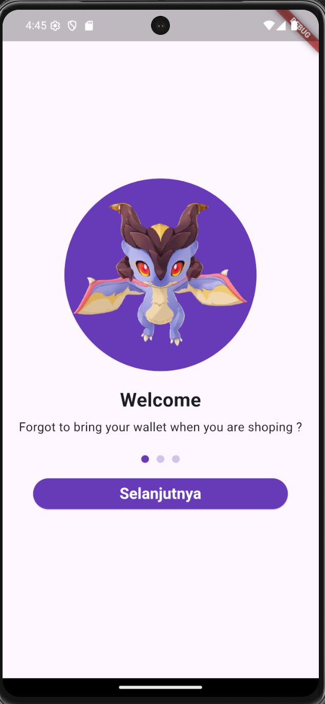
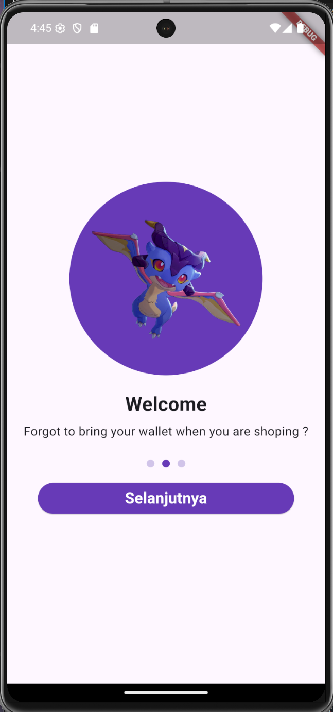
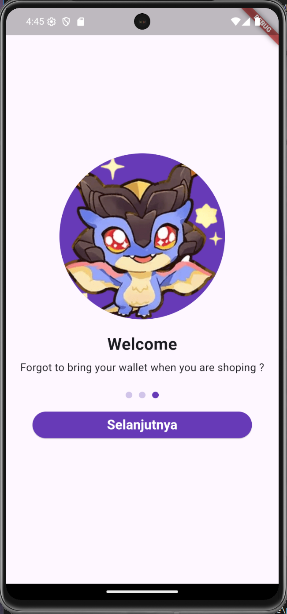
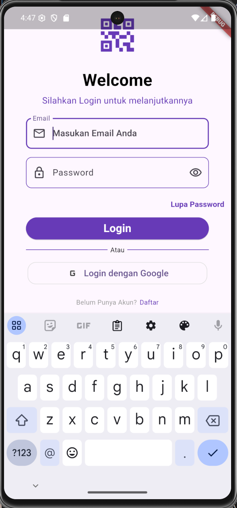
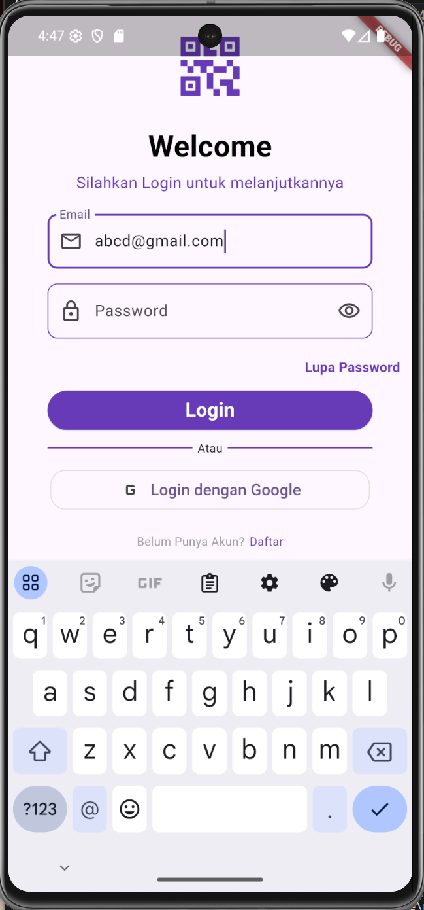
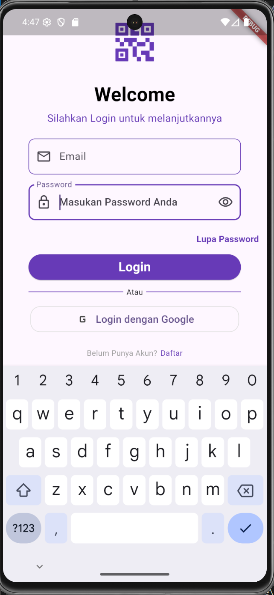

# projek_uas

A new Flutter project.

## Identitas
**Nama:** Mahesha Suro
**NIM:** 1125170137

## Hasil Screenshot









## Cara Menjalankan Project
1. **Clone repository dari GitHub**
   ```bash
   git clone https://github.com/mahesa60/KB1179-1125170137-uas
2. cd projek_uas
3. flutter pub get
4. flutter run

## Getting Started

This project is a starting point for a Flutter application.

A few resources to get you started if this is your first Flutter project:

- [Lab: Write your first Flutter app](https://docs.flutter.dev/get-started/codelab)
- [Cookbook: Useful Flutter samples](https://docs.flutter.dev/cookbook)

For help getting started with Flutter development, view the
[online documentation](https://docs.flutter.dev/), which offers tutorials,
samples, guidance on mobile development, and a full API reference.
